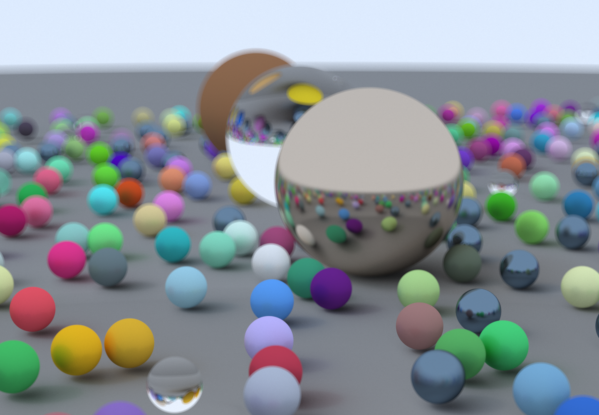
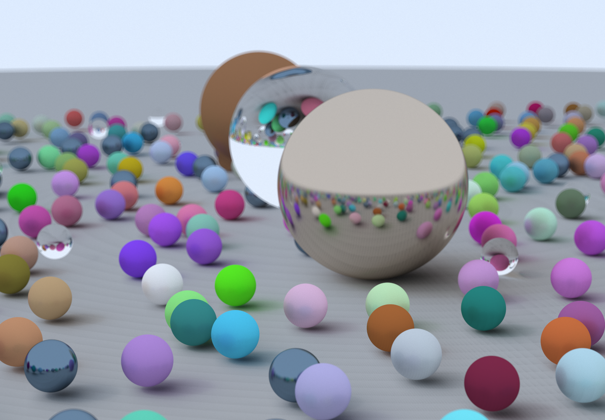
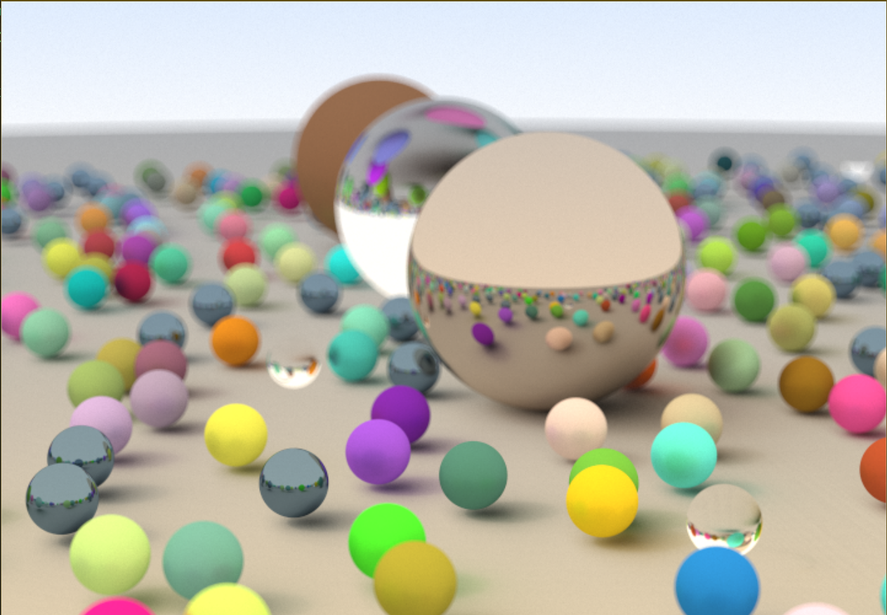

# Ray Tracing in One Weekend with Taichi

<div align="center">
  
</div>

## Overview

This project implements a ray tracer using the [Taichi programming language](https://github.com/taichi-dev/taichi), based on Peter Shirley's excellent book [Ray Tracing in One Weekend](https://raytracing.github.io/books/RayTracingInOneWeekend.html).

### How to Run


### Why Taichi?

- **Simpler Implementation**: Taichi eliminates the need for complex smart pointers used in the original C++ implementation
- **GPU Acceleration**: Offers superior parallel processing capabilities compared to CPU-based multi-threading (like OpenMP)
- **Developer Friendly**: Focus on the ray tracing algorithm without worrying about memory management

## Getting Started

### Prerequisites
```bash
pip install taichi
```

### Running the Ray Tracer
```bash
python weekend.py
```
The program will generate a ray-traced image using your GPU for acceleration.

## Technical Challenges
> This part was written in 3 years ago, and I think the situation has changed a lot :)
### 1. Numerical Precision Issues

~~Taichi uses 32-bit floating-point numbers by default. In the showcase image above, the sphere representing the ground has too large a radius, which hit numerical precision limitations. Under 32-bit floating-point representation, this caused mysterious textures as shown below~~

[neozhaoliang](https://github.com/neozhaoliang) pointed out that the banding was caused by mistakenly using sphere sampling instead of hemisphere sampling for diffuse materials. After modification and testing, this was indeed the case. However, what puzzles me is that switching to 64-bit floating-point numbers also resolved the banding. There might be some mysterious mechanism at work.

<div align="center">
  
</div>

#### Solutions:

1. **Reduce Ground Sphere Radius**
   - Decrease from 1000 to approximately 600
   - Quick and effective solution

2. **Use 64-bit Floating Point**
```python
# ray_module.py , line 5:
use_f64 = False # switch True to use Double-precision floating-point 
float_type = ti.f32
if use_f64:
    float_type = ti.f64
vec3 = ti.types.vector(3, float_type)
```
   Note: This solution comes with significant performance overhead

### 2. Yellow Ground Artifact

<div align="center">
  
</div>

This issue emerged when converting the ray class to `ti.struct_class`. The root cause was that Taichi's `struct_class` doesn't automatically invoke Python's `__init__` function, leaving ray directions unnormalized. Manual normalization fixed the problem.

### 3. GPU Utilization

Currently experiencing unexpectedly low GPU utilization (near 0%) during execution. Potential causes under investigation:
- Inefficient memory access patterns
- Python-scope constructor overhead
- Suboptimal ray intersection parallelization

## References

- [bsavery/ray-tracing-one-weekend-taichi](https://github.com/bsavery/ray-tracing-one-weekend-taichi)
- [erizmr/taichi_ray_tracing](https://github.com/erizmr/taichi_ray_tracing)
- [Ray Tracing in One Weekend](https://raytracing.github.io/books/RayTracingInOneWeekend.html)